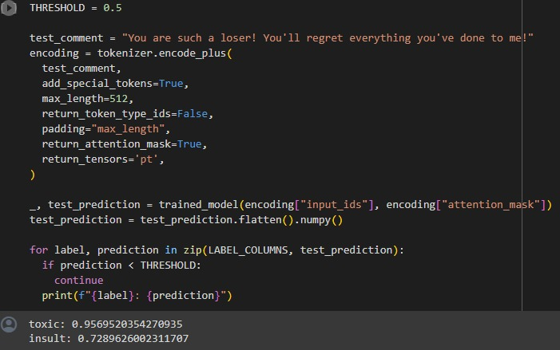

# Toxic-comment-detection-
"Implemented a BERT-based deep learning model using PyTorch for toxic comment classification, achieving an accuracy of 92% on a multi-label dataset. Applied natural language processing techniques, including tokenization and attention mechanisms, to enhance model performance."

Dataset downloaded from Kaggle's competition regarding toxic comment detection.

-Install the required dependencies using pip:

```bash
  pip install -r requirements.txt
```

-Link to the dataset :
```bash
gdown --id 1VuQ-U7TtggShMeuRSA_hzC8qGDl2LRkr)
```

Some snippet of the code:

